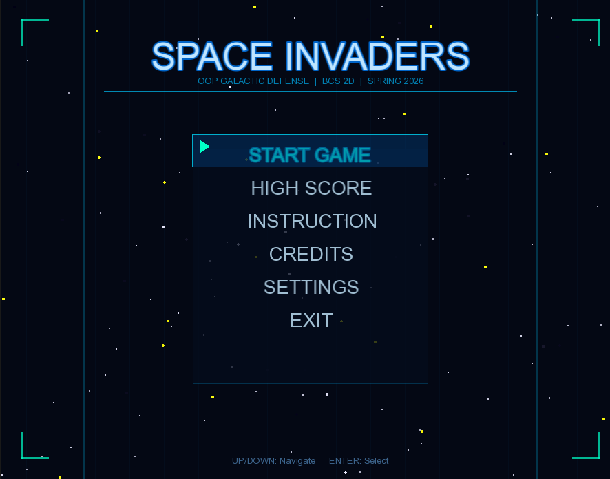
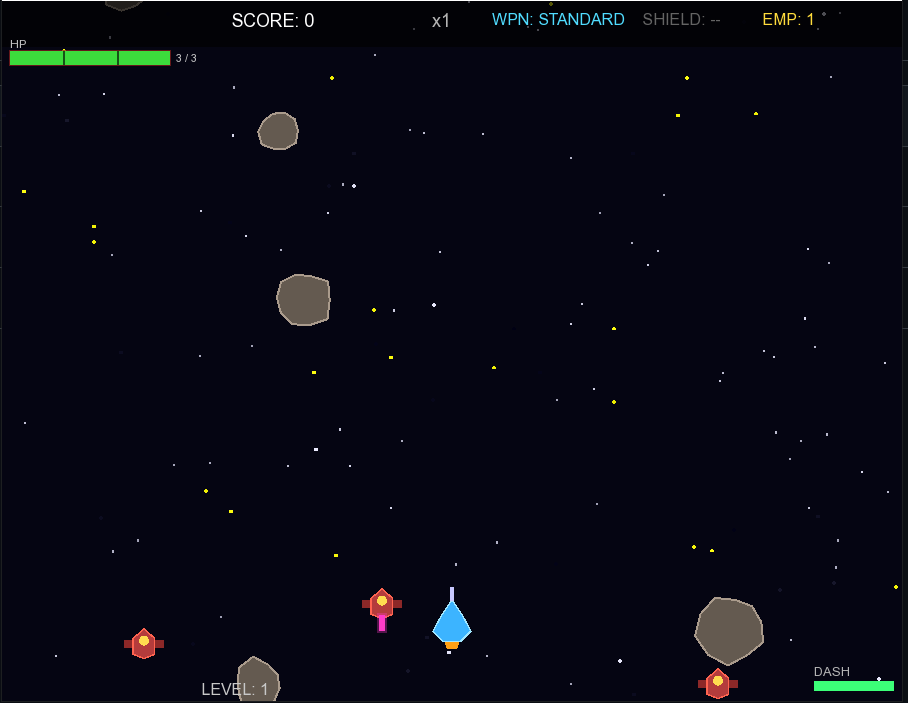
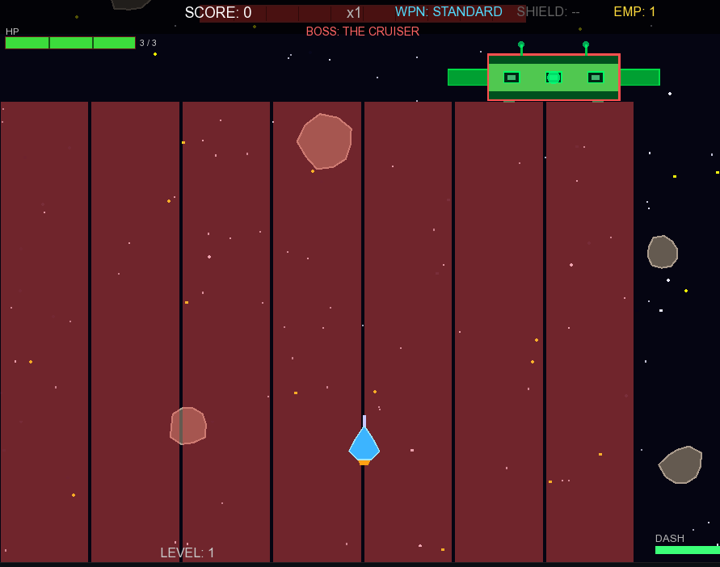
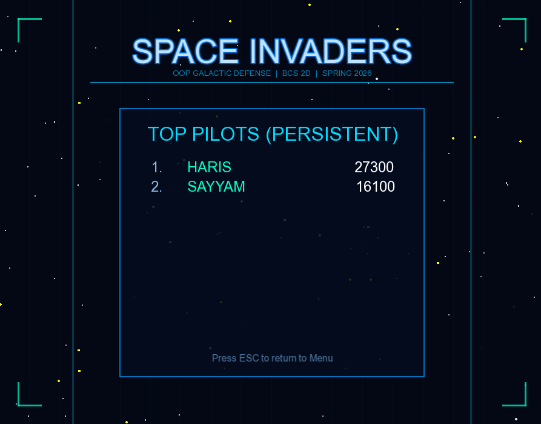

# Space Invaders: Object-Oriented Galactic Defense

A C++17/SFML arcade shooter inspired by *Space Invaders*, built as an Object-Oriented Programming project. The game includes multiple play modes, enemy waves, boss encounters, power-ups, audio feedback, a scoring system, settings, and persistent leaderboard support.

## Screenshots

| Main Menu | Gameplay |
|------------|------------|
|  |  |

| Boss Fight | Leaderboard |
|------------|------------|
|  |  |

## Features

- Real-time 2D arcade gameplay using SFML.
- Arcade Mode and Survival Mode.
- Multiple game states: menu, playing, pause, game over, win, high score, instructions, credits, username input, and settings.
- Player movement, shooting, dash mechanics, shield support, EMP ability, and weapon upgrades.
- Enemy inheritance hierarchy with different enemy types:
  - **Drone** — basic straight-moving shooter.
  - **Viper** — sine-wave movement pattern.
  - **Seeker** — tracks the player position.
- Boss encounters including Cruiser, Twin Cannons, and Mothership.
- Collision handling for bullets, enemies, asteroids, bosses, power-ups, and player interactions.
- Score multiplier system, animated explosions, starfield background, HUD, and leaderboard persistence.
- Audio manager for sound effects and music handling.
- Manual dynamic memory management using raw-pointer arrays, destructors, and cleanup routines.

## Tech Stack

- **Language:** C++17
- **Library:** SFML 3
- **Build Tools:** CMake / Makefile
- **Core Concepts:** OOP, inheritance, polymorphism, composition, dynamic memory management, game loops, collision detection, and state management

## Object-Oriented Design

The project is structured around reusable classes and inheritance-based gameplay entities.

```text
GameObject
└── Entity
    ├── Player
    ├── Enemy
    │   ├── Drone
    │   ├── Viper
    │   ├── Seeker
    │   └── Boss
    │       ├── Cruiser
    │       ├── TwinCannons
    │       └── Mothership
    ├── Bullet
    ├── PowerUp
    ├── Asteroid
    └── Explosion
```

## Project Structure

```text
.
├── main.cpp
├── Game.cpp / Game.h
├── Player.cpp / Player.h
├── Enemy.cpp / Enemy.h
├── Drone.cpp / Drone.h
├── Viper.cpp / Viper.h
├── Seeker.cpp / Seeker.h
├── Boss.cpp / Boss.h
├── Cruiser.cpp / Cruiser.h
├── TwinCannons.cpp / TwinCannons.h
├── Mothership.cpp / Mothership.h
├── Bullet.cpp / Bullet.h
├── PowerUp.cpp / PowerUp.h
├── Asteroid.cpp / Asteroid.h
├── Explosion.cpp / Explosion.h
├── CollisionManager.cpp / CollisionManager.h
├── AudioManager.cpp / AudioManager.h
├── GameStateManager.cpp / GameStateManager.h
├── HUD.cpp / HUD.h
├── Settings.cpp / Settings.h
├── Starfield.cpp / Starfield.h
├── CMakeLists.txt
├── Makefile
└── screenshots/
```

## How to Run

### Option 1: Using CMake

Make sure SFML 3 is installed and available to CMake.

```bash
cmake -S . -B build
cmake --build build
```

Run the generated executable from the build output folder.

On Windows, if CMake cannot find SFML automatically, pass the SFML path manually:

```bash
cmake -S . -B build -DSFML_DIR="C:/SFML/lib/cmake/SFML"
cmake --build build
```

### Option 2: Using Makefile

```bash
make
./SpaceInvaders
```

> Note: The Makefile assumes SFML is installed and linked correctly in your compiler environment.

## Controls

The game supports keyboard-based movement, shooting, dash, EMP, menu navigation, and configurable settings. Controls can be adjusted from the in-game settings system.

## Learning Outcomes

This project strengthened my understanding of:

- Designing class hierarchies for game entities.
- Applying inheritance and polymorphism in a real-time application.
- Managing dynamic objects with raw pointers and explicit cleanup.
- Building a game loop with event handling, update logic, and rendering.
- Implementing collision detection, state transitions, score systems, and persistent leaderboard storage.

## Author

**Rana Haris**  
BS Computer Science, FAST NUCES
